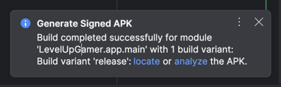
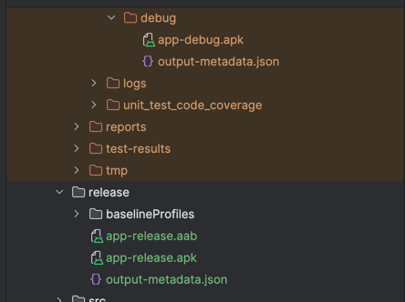
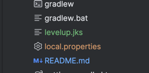
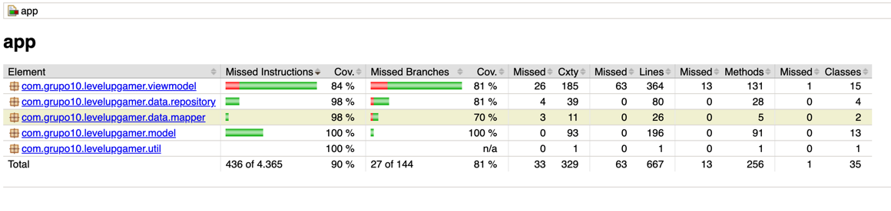

# LevelUpGamer

## Integrantes

- Onésimo Aguirre
- Manuel Alfaro
- Alex Caica

## Descripción del Proyecto

LevelUpGamer es una aplicación móvil Android desarrollada en Kotlin para la compra de videojuegos y accesorios gaming. La aplicación permite a los usuarios explorar productos, gestionar su carrito de compras, buscar tiendas cercanas y realizar pedidos.

## Funcionalidades

### Autenticación y Usuario
- Registro de nuevos usuarios
- Inicio de sesión
- Consulta de información del usuario actual
- Actualización de dirección del usuario

### Catálogo de Productos
- Listado de todos los productos disponibles
- Filtrado por categoría
- Búsqueda de productos por nombre
- Filtrado de productos con descuento
- Visualización de detalles de producto

### Gestión de Carrito
- Agregar productos al carrito
- Actualizar cantidad de productos en el carrito
- Eliminar productos del carrito
- Limpiar carrito completo
- Visualización del carrito de compras

### Tiendas
- Listado de todas las tiendas
- Búsqueda de tienda más cercana por geolocalización

### Geocodificación
- Búsqueda de direcciones mediante coordenadas
- Validación de direcciones

## Endpoints Utilizados

### API del Microservicio (Backend Propio)

#### Autenticación
- `POST /api/auth/register` - Registro de usuario
- `POST /api/auth/login` - Inicio de sesión
- `GET /api/auth/me` - Obtener usuario actual
- `PUT /api/auth/update-address` - Actualizar dirección

#### Productos
- `GET /api/products` - Obtener todos los productos (con filtros opcionales)
- `GET /api/products/{id}` - Obtener producto por ID

#### Tiendas
- `GET /api/stores` - Obtener todas las tiendas
- `GET /api/stores/nearest` - Obtener tienda más cercana

#### Carrito
- `GET /api/cart` - Obtener carrito del usuario
- `POST /api/cart` - Agregar producto al carrito
- `PUT /api/cart/{id}` - Actualizar item del carrito
- `DELETE /api/cart/{id}` - Eliminar item del carrito
- `DELETE /api/cart` - Limpiar carrito completo

### API Externa

#### Nominatim (OpenStreetMap)
- `GET /search` - Búsqueda de direcciones y geocodificación
  - Base URL: https://nominatim.openstreetmap.org/

## Pasos para Ejecutar

### Requisitos Previos

- Android Studio Hedgehog o superior
- JDK 17 o superior
- Gradle 8.0 o superior
- Dispositivo Android o emulador con API 26 (Android 8.0) o superior

### Configuración

1. Clonar el repositorio:
```bash
git clone <url-del-repositorio>
cd LevelUpGamer_Grupo10
```

2. Crear el archivo `local.properties` en la raíz del proyecto con las siguientes variables:
```properties
BASE_URL=http://10.0.2.2:3000/api/
NOMINATIM_URL=https://nominatim.openstreetmap.org/
```

3. Sincronizar el proyecto con Gradle en Android Studio.

4. Ejecutar el backend del microservicio (debe estar corriendo en el puerto 3000).

### Ejecución

#### Modo Debug
1. Conectar un dispositivo Android o iniciar un emulador
2. Seleccionar el módulo `app` en Android Studio
3. Hacer clic en el botón Run o usar el atajo `Shift + F10`

### Ejecutar Tests Unitarios

```bash
./gradlew testDebugUnitTest
```

### Generar Reporte de Cobertura con Jacoco

```bash
./gradlew clean testDebugUnitTest jacocoTestReport
```

El reporte se generará en: `app/build/reports/jacoco/testDebugUnitTestCoverage/html/index.html`

## Capturas

### APK Firmado



### Archivo JKS


### Cobertura de Código con Jacoco


## Tecnologías Utilizadas

- Kotlin
- Jetpack Compose
- Retrofit para consumo de APIs
- Coroutines para programación asíncrona
- Hilt para inyección de dependencias (si aplica)
- JUnit y Mockito para testing
- Jacoco para cobertura de código

## Estructura del Proyecto

```
app/
├── src/
│   ├── main/
│   │   ├── java/com/grupo10/levelupgamer/
│   │   │   ├── data/
│   │   │   │   └── remote/
│   │   │   │       ├── api/        # Interfaces de Retrofit
│   │   │   │       └── dto/        # Data Transfer Objects
│   │   │   ├── domain/             # Modelos de dominio
│   │   │   ├── ui/                 # Pantallas y componentes UI
│   │   │   └── MainActivity.kt
│   │   └── res/                    # Recursos (layouts, drawables, etc.)
│   └── test/                       # Tests unitarios
└── build.gradle.kts
```

